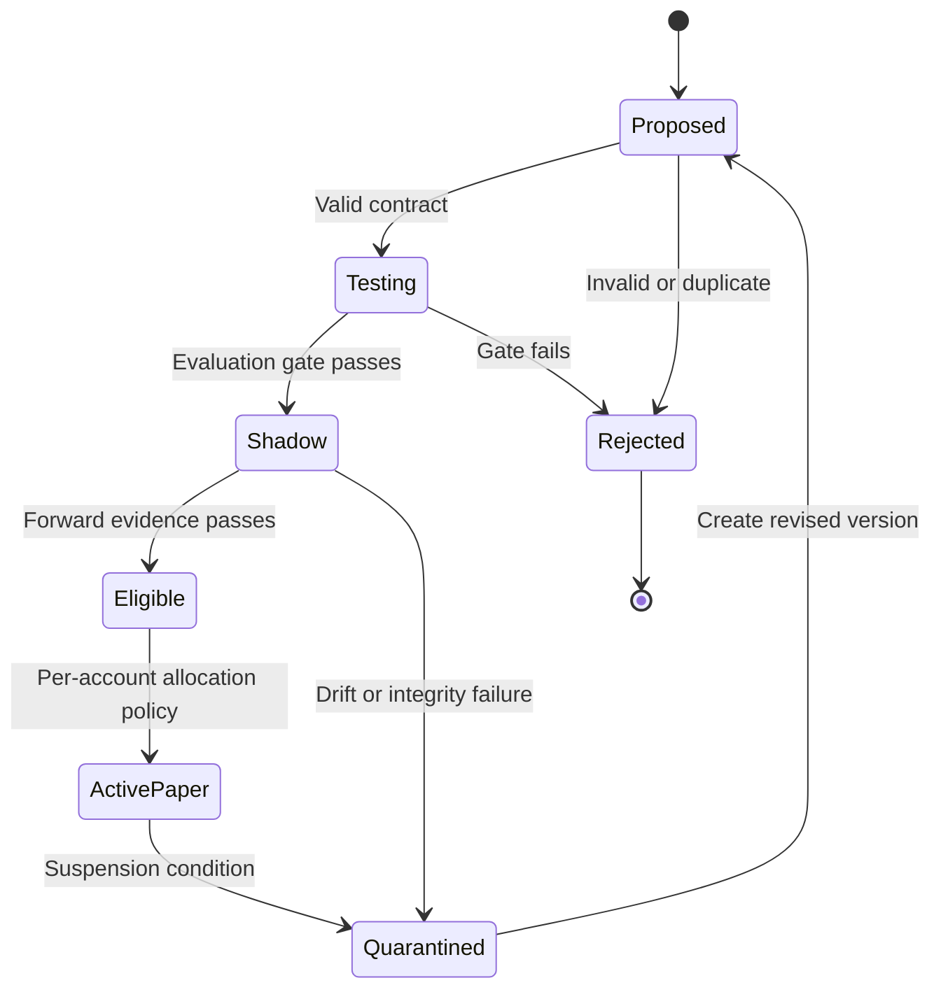

# Trezo autonomous strategy creation and adaptation

Status: broader architecture specification, September 8, 2026. Companion to the [robustness review](TREZO_ROBUSTNESS_REVIEW_2026_09_08.md). A restricted internal research pilot is now implemented locally as described in the follow-up plan; the full architecture, forward-paper promotion and general LLM inventor remain incomplete. Nothing is deployed by this document, and the existing trading autonomy mode is unchanged.

Follow-up: the [learning-loop build plan](TREZO_LEARNING_LOOP_BUILD_PLAN.md) records the connected-database/code audit and the required durable job path. Mike clarified that strategy creation and testing should run internally, without routing reports through Discord. Model calls should propose/revise hypotheses; deterministic code should perform numerical testing and routine orchestration.

## Product requirement

Trezo's agents should create and test their own trading hypotheses, adapt to changing conditions, recognize deterioration, and retain evidence of what worked and failed. Mike should not have to invent every rule or approve every routine research experiment. The system should optimize measured net performance within account constraints; novelty, a high win rate, or a target daily profit is not evidence of an edge.

Use two connected processes. The fast process reacts to fresh events using previously evaluated rules and allocation policies. The slower research process creates new strategy versions and evaluates them before promotion. A breaking headline can justify an immediate decision under an existing policy without making that headline sufficient evidence for a brand-new strategy.

### Annual outcomes and accessible balances

Use the [capital and income plan](TREZO_ROBUSTNESS_REVIEW_2026_09_08.md#annual-capital-growth-and-income-planning) as the product context: confirmed $1,000/$5,000 initial research balances, optional contributions, and a longer-term $20,000–$40,000 supplemental annual income ambition with accumulation before a year-end withdrawal review. Keep annual income, target account value and eligible payout as distinct fields. Six-figure income remains aspirational; the earlier $250,000/$1 million examples are comparisons, not operating assumptions. Retain the earlier 4%-monthly and $500-from-$5,000 requests as alternative stress cases. No goal or withdrawal setting is a return forecast or a promise of payment.

Begin research comparisons with $1,000 and $5,000; add $500 eligibility/cost cases and larger comparisons where useful. Treat $25,000, $50,000 and $100,000 as progress milestones, not admission requirements or guaranteed outcomes. Record monthly income coverage and annual totals without converting the requested amount into forced trading or automatic risk increases. Model time and capital growth across contribution/return assumptions explicitly; never promise every user the same balance or deadline.

The offline `app.paper.income_planner` command now supports the two starting cases and two supplemental-income goals. It is an arithmetic utility with explicit return assumptions, not a strategy evaluator or an account-performance source. Neither a profitable illustrative row nor its `income_goal_met` field may be consumed as evidence for promotion. Actual strategy performance and withdrawal eligibility remain explicitly unverified in its output.

Every candidate must be evaluated at the account's actual scale after position rounding, contract minimums, fees, allocated platform costs and reserved capital. Report growth without new deposits separately from outcomes with contributions. A strategy that succeeds only with larger capital must not be silently offered to a smaller account, and a high return estimate must never override the account's loss limit.

Support proposed build-capital and take-income modes. Reinvestment is the capital-building scenario; withdrawals depend on eligible profits and retained capital under an explicit account policy. There is no automatic first-year or year-two income promise. Test deferred annual dollar requests, percentage-of-account requests, fixed household expenses and profit-only payments separately, and show any use of principal or new deposits rather than labeling it investment income. In take-income mode, display the requested amount and the amount supported by the selected eligibility policy; the latter may be lower or zero. The research agent cannot invent a return assumption to satisfy an income goal, change an owner's loss budget, or initiate deposits or withdrawals. Account modes and income reporting remain specification work in this branch.

A year-end threshold crossing must schedule an income review, never trigger a trade or transfer by itself. Reconcile actual cash, marked positions, costs, contributions, prior unrecovered losses and retained-capital requirements before proposing a payout. Include regression scenarios for deposits crossing a balance threshold, open losses offsetting realized wins, and a profitable early period followed by a year-end loss. The inventor must not choose more leverage simply because a desired six-figure income exceeds what the current account can support.

## What exists at the reviewed commit

| Component | Actual behavior | Extension required |
|---|---|---|
| `StrategyDiscoveryAgent` | Hourly realized-performance summaries, weak-strategy warnings, a 25-trade review flag, and average backtest-return memory | Hypothesis generation, immutable candidates, trial tracking, independent evaluation and a promotion state machine |
| `AdaptiveScopeAgent` | Regime posture every ten minutes and event-driven ticker flags | Calibrated adaptation policies, freshness checks, explicit scope and evidence; preserve per-account execution authority |
| `ResearchAgent` | Upcoming earnings and ex-dividend events | Research jobs with reproducible data and strategy artifacts |
| `MarketSentimentAgent` | Equity company-news classification, with an existing Anthropic client and keyword fallback; scheduled in an equity news window | Event provenance, deduplication and latency history; crypto and social coverage need separate feeds |
| `risk_manager` | Consumes scope pauses, confidence adjustments and stop multipliers | Revalidate every promoted candidate against account capabilities, reserved capital and portfolio exposure |
| Existing strategy library / backtest | A fixed catalog and simplified historical simulation | A restricted strategy language plus faithful replay; unrestricted generated code belongs in a separate research worker |

The current `suggest`, `guarded`, and `full` autonomy modes control predefined scope adjustments. They are not permissions for arbitrary strategy invention or self-deployment. Preserve them until an explicit migration defines the new research and execution policies.

## Research roles and outputs

These are responsibilities; they can extend existing agents without adding a separate LLM for every role.

| Role | Output | Authority |
|---|---|---|
| Context analyst | Timestamped regime, liquidity, event and attention features, with source evidence and uncertainty | Read data; flag stale or conflicting evidence |
| Strategy inventor | A falsifiable hypothesis and structured strategy candidate | Create research candidates; no broker or risk-setting access |
| Experiment runner | Reproducible historical and forward-paper results | Run isolated, budgeted jobs; no capital allocation |
| Independent evaluator | Acceptance/refusal evidence against a frozen evaluation policy | Advance eligible research states; cannot rewrite results or policy |
| Allocation controller | Choice among eligible strategy versions within each account's approved limits | Use only approved instruments, risk envelopes and execution interfaces |
| Decay monitor | Degradation alerts, quarantine decisions and new research tasks | Apply approved suspension rules and request replacements |

The independent evaluator must recompute metrics from trusted fills and valuations. Another language model agreeing with the inventor is not independent validation.

## Candidate contract

Each candidate is immutable and records:

- Identity: strategy ID, version, parent version, owner/scope, creation time, proposer model and prompt version, and a content hash.
- Hypothesis: why an effect may exist, target instruments, intended horizon, applicable regimes, and observations that would falsify it.
- Rules: allowed inputs, deterministic entry/exit conditions, position-sizing policy reference, maximum holding period, and prohibited conditions. The referenced account risk policy is externally controlled.
- Evidence: source IDs, dataset snapshot/hash, publication and first-observed times, feature/model versions, and lineage to earlier experiments.
- Evaluation contract: frozen train/validation/holdout windows, cost-model version, benchmark, acceptance rules, and maximum research spend/trial count.
- Results and lifecycle: evaluation-run IDs, state, transition reason, evaluation-policy version, and rollback/suspension information. Results are appended; existing definitions and rejected trials are retained.

Begin with a restricted declarative language that composes reviewed features, conditions and exits. Reject unknown fields, unsupported instruments, unbounded parameters, dynamic imports, shell commands, network requests and arbitrary expressions. That permits meaningful new combinations without running model-generated Python inside the trading process.

For genuinely new indicators or model families, the inventor may write candidate code in an isolated worker. Give it a read-only dataset, fixed dependencies, no trading secrets, no production network access, and CPU/memory/time limits. A new executable primitive needs code review and integration tests before entering the approved runtime catalog. Once a primitive is approved, agents may research permitted combinations automatically.

## Lifecycle and automation

All states through `ActivePaper` are research or paper states. The production system remains paper-only. Future live eligibility is a separate controlled capability under the existing go-live checklist; it is not a transition the inventor can unlock.

Automatic candidate creation, rejection, testing, shadow evaluation and paper promotion can operate under a policy approved once, subject to defined budgets. Routine compliant experiments need no individual approval. A new risk envelope, account permission, executable primitive or live release requires its own review. Agents cannot relax acceptance criteria after seeing a failed result.

Keep currently active and candidate strategies separate. A candidate can win a forward comparison without taking over open positions. Every position retains its originating strategy version and exit policy. Define transition handling for open positions before any allocation switch; switching the entry selector must not silently rewrite exits.

## News, social information and seasonality

Store event IDs, source/venue, canonical instrument IDs, original publication time, ingestion time, revision history, and the exact text or permitted archived representation. Only information actually available by a simulated decision time can enter that decision. Record delivery latency and outages. Missing social data is unknown, not neutral sentiment.

Treat article and social text as untrusted data. Retain structured-output validation and put permissions outside the model. Removing a few suspicious phrases is not a complete security boundary. Research text cannot issue orders, change limits, select credentials or override evaluation rules.

For social features, distinguish original posts from reposts, detect likely coordinated activity, resolve ambiguous tickers, and require independent corroboration for factual claims. Measure attention changes and disagreement as candidate features rather than accepting popularity as truth. FINRA and the SEC specifically describe stale, misleading and manipulated social data as risks for these tools. [FINRA/SEC social-sentiment bulletin](https://www.finra.org/investors/insights/social-sentiment-investing-tools)

Treat seasonality as a hypothesis. Test calendar, earnings-cycle and session effects across multiple relevant cycles, account for timezone and holiday changes, and compare with a model that excludes the seasonal feature. A single good month does not establish a recurring effect.

Falling net expectancy, wider execution costs, altered feature distributions or increased correlation may trigger decay investigation. They do not prove other traders copied a strategy. Diagnose data failure, implementation changes and ordinary sampling variation before treating every losing sequence as a new regime. Use predeclared monitoring thresholds, minimum evidence, cooldowns and switch limits to avoid continual strategy churn.

The existing equity news window is insufficient for a 24/7 crypto research loop. Add feeds only after documenting coverage, history, latency, timestamps, retention rights, costs and outage behavior. No social data source has been wired by this review.

## How to judge new strategies

Record every attempted variation, including failures and manually discarded ideas. Searching many alternatives can produce impressive historical winners by chance; ordinary holdout testing alone is not a complete correction for investment backtest selection. Incorporate multiple-testing/selection diagnostics suitable for the experiment and preserve a locked forward-paper evaluation. [Bailey et al., The Probability of Backtest Overfitting](https://scholarworks.wmich.edu/math_pubs/42/)

Use time-ordered evaluation with leakage controls appropriate to overlapping features and holding periods. Test realistic fees, spreads, slippage, gaps, partial fills, asset permissions and account size. Apply the same deterministic sizing and exposure rules that execution uses. Report net expectancy with uncertainty, marked-equity drawdown and capital usage against a benchmark and the current strategy, not merely the best historical return.

For an LLM using historical articles, restricting the input window is necessary but may not eliminate future knowledge already present in model training. Use the model primarily to propose rules, document this limitation, and require genuinely forward evidence.

An illustrative research candidate might ask: after a corroborated company catalyst, does a liquid-stock breakout with independently increasing attention outperform the same breakout without the attention feature? The agent would compare the two, include delayed entry and costs, and reject the idea if the extra feature adds no reliable value. This is a proposed experiment, not a trading recommendation or established effect.

## Implementation sequence and proof of binding

1. **Repair evaluation inputs.** Complete reconciled returns and historical-replay repairs identified in the robustness review. Existing realized-only performance and average backtest-return memory must not be automatic promotion criteria.
2. **Add candidate storage and validation.** Proposed tables are `strategy_candidates`, `strategy_trials`, and append-only `strategy_transitions`. Include owner/scope on every applicable record, unique version hashes, RLS, idempotent transitions and evaluation-policy IDs. Inspect Trezo's actual migrations before preparing schema changes; no migration is included here.
3. **Extend discovery.** Keep existing metrics, then enqueue a bounded research job when a scheduled exploration budget or a qualified decay/event trigger allows it. Validate model output against the candidate contract and persist it before scheduling a trial. Reuse the established provider interface where suitable; no additional AI subscription is assumed.
4. **Run isolated experiments.** Connect candidate IDs to immutable datasets and the repaired evaluator. The worker writes results, never activation settings. A failed or missing data read cannot produce a passing evaluation. Research storage failure leaves the job visibly failed/retryable.
5. **Bind paper selection.** A deterministic controller verifies candidate state, evidence, instrument compatibility and per-account policy before the existing scanner/risk/execution path can consume a version. Require a durable activation record. Keep the last known-good version and preserve existing positions' exit policies.
6. **Add monitoring and product visibility.** Show what is trading, what is being tested, why a version changed, rejected hypotheses, data health, experiment costs and per-account eligibility. Keep the daily account outcome visible beside strategy statistics.

Acceptance tests must trace real call paths: a seeded event leads to a stored candidate and a scheduled trial; malicious or malformed text cannot become executable instructions; missing timestamps cannot pass evaluation; duplicate triggers do not create duplicate trials; a failing holdout cannot promote; a valid paper candidate reaches the selector only after policy checks; one owner's candidate/halts cannot affect another; replaying an activation is idempotent; and paper activation cannot reach a live endpoint. These tests must run in Trezo's plain deployment harness as well as pytest, without broker calls.

This design makes autonomous strategy creation a concrete build requirement. Its first dependency is trustworthy data and evaluation, so the system can distinguish adaptation that improves results from adaptation that merely fits recent history.
