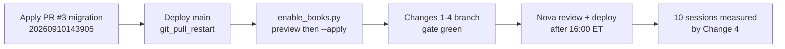

# Trezo Day-Trade Income Handoff

Prepared 2026-09-21 by Nova for Codex, for Mike. Decision recorded 2026-09-21: the goal lock (Change 3) ships ON.

## Goal and non-goals

Goal: make Trezo's day trades a dependable daily income across the three paper books, measured from the broker's own fill receipts, without loosening any risk gate. Four changes are specified below; each is small, has a named file, an audible log row, and a guard test that runs under the bare gate (`agents/tests/run_all.py`).

Non-goals: no new strategies, no wider stops or targets, no change to kill switches, no rewriting of historical balances, no orders placed to gather evidence. Codex works on `main` at or after commit `7096970` (PR #3 merged, not yet deployed); Nova reviews, gates and deploys.

## Evidence

The books are up about $2,760 combined since August, but the two large books carry a small one that loses, and the loss has a measurable mechanism: same-coin churn. Broker equity as of 2026-09-18 16:00Z, read with each book's own credentials:

| book | account key (`user_id`) | equity | vs start | cash |
| --- | --- | --- | --- | --- |
| primary | `cf1b0460-039d-40ac-adc8-7ca3ef17c5bb` | $4,716.75 | −$283 (−5.7%) | −$248.32 |
| 25k | `6ce61054-7ffd-41b5-80c3-1cd0220c79eb` | $26,637.94 | +$1,638 (+6.6%) | $21,210.95 |
| 75k | `49acafdd-1c86-4740-a1b1-f94aa7abce08` | $76,405.44 | +$1,405 (+1.9%) | $51,889.95 |

The churn, from `GET /v2/account/activities/FILL` on the primary, 2026-09-16 to 09-18: SOL was fully exited and re-bought 12 times in 38 hours, LINK 8 times. Typical pairs: sell 99.6423 / buy 99.596; sell 100.32 / buy 100.20; sell 105.507 / buy 105.50; sell 106.12 / buy 106.20. Each cycle captures within ±0.1% and pays about 0.55% (26 bps fee per side plus spread). On a \~$700 position that is $4–5 per cycle, roughly $40–60 per day on a $4.7k book — about 1% of equity per day in friction, before any edge is measured. Re-entry after a full exit has no cooldown and no price condition in the current code.

Other facts that bound the design:

- Alpaca paper enforces the pattern-day-trader rule: under $25,000 equity, 3 stock day trades per 5 sessions; `daytrade_count` and `pattern_day_trader` come back on `GET /v2/account`. Only `options_scanner.py` (line \~843) is PDT-aware today; the stock scalp lanes (STMS, ORB, scalps with the 90-minute max hold) are not. A rejected fourth day trade is a broker reject, and 3 rejects in 60 minutes trips the kill switch.
- The daily goal (`agents/app/paper/daily_goal.py`, rungs $50 / $110 / $225 / $293 / $480 …) only makes new entries pickier once hit (+5 TCS in `risk_manager.py` \~line 727). Nothing locks a banked day.
- The one full-day sample with a profit factor on record (2026-09-02) was 0.03 on 55 closes.
- The 09-18 modeled-close defect (stale candle priced a stop; broker fills booked at candle × slippage) is fixed and deployed in `376fce1`; the five affected rows were repaired from receipts (+$372.35).

## Change 1 — Same-symbol re-entry discipline

After a full exit, a book may re-enter the same symbol only after a cooldown AND only if price has moved past the last exit by at least the round-trip cost. Both conditions live in the executor's per-book fan-out, so a rule for one book never touches another.

Where: `agents/app/agents/trade_execution.py`, in the per-book loop, after `book_already_holds` and before the capacity checks (the block that emits `book_at_capacity` / `pocket_at_capacity`, \~lines 800–880). Read this book's most recent closed `paper_positions` row for the ticker (`status` like `closed_%`, `exit_at`, `exit_price`, `side`).

Rules:

1. Cooldown: refuse if `now - exit_at < TREZO_REENTRY_COOLDOWN_MIN` (default 90 minutes; crypto and stock alike).
2. Price-beyond-cost: for a long re-entry refuse unless `entry_price <= exit_price × (1 − cost)` or `entry_price >= exit_price × (1 + cost)`; mirror for shorts. `cost` = the lane's round trip: crypto `0.0062` (the model constant), stock `TREZO_REENTRY_MIN_MOVE_STOCK` default `0.0015`. A re-entry inside that band cannot be positive-expectancy by construction.
3. Neither rule applies to a first entry, to an add on an open row (the existing 18-hour accumulation cooldown governs adds), or when the last close is older than `TREZO_REENTRY_LOOKBACK_H` (default 24h).

Audible: refusals write an activity row `reentry_refused` naming book, ticker, minutes since exit, last exit price, proposed entry, and which rule bit — same shape as `pocket_at_capacity` (late import of `activity_log.record`, wrapped in try/except). The bus message is `kind="info"` with `payload.event="reentry_refused"`; add that spelling to `_DELIBERATE_REFUSALS` in `agents/app/agents/ops_watchdog.py` so the flow alarm counts it as an outcome.

Guards (`agents/tests/test_reentry_discipline.py`, house convention: `_bootstrap.stub_config()`, `load_module`, a `_patched` that always restores, no pytest fixtures, no wall clock over fixed fixtures): refused inside the cooldown; refused inside the cost band after the cooldown; allowed beyond the band; a first entry untouched; an add on an open row untouched; two books judged independently on the same ticker; the watchdog counts the refusal; the call site is pinned by source (`_DELIBERATE_REFUSALS` contains the spelling; the executor emits it).

## Change 2 — PDT guard per book

A book under the pattern-day-trader line must never send a fourth stock day trade, and a PDT rejection must never count toward the reject-storm kill switch. Equities day-trade only on books that can afford it; the small book runs crypto and multi-day swings.

Where: `agents/app/agents/trade_execution.py`, in the per-book stock branch before order submission. Read the bound book's account (`alpaca.get_account()` inside the existing `bind_for_user` binding; use the per-book 60s cache the executor already keeps, never the primary's snapshot — see TE-19 in `risk_manager.py` \~line 758 for the trap).

Rules:

1. Intraday strategies = the set the position monitor time-stops (`scalp`, `orb`, `stms`, and any strategy with `max_hold_90min` / `force_exit_345pm` semantics). Everything else (extended swings, dividend ladder, wheel) is exempt.
2. If `equity < 25,000 + TREZO_PDT_BUFFER_USD` (default `2,500`) and the strategy is intraday: refuse when `daytrade_count >= 3` or `pattern_day_trader` is true. Under `TREZO_PDT_MIN_EQUITY` (existing knob, default `2,000`) refuse all intraday stock entries.
3. Classify broker errors: a reject whose message contains `day trad` (Alpaca's PDT wording) writes `pdt_reject` and does NOT increment the reject-storm counter in the per-book kill switch (`risk_manager.py` broker-reject window, 3 in 60 min).
4. Options: keep the existing `options_scanner.py` PDT phase-in; do not duplicate it.

Audible: `pdt_guard` activity row with book, ticker, strategy, equity, `daytrade_count`, and the buffer; bus `kind="info"`, `payload.event="pdt_guard"`; add to `_DELIBERATE_REFUSALS`.

Guards (`agents/tests/test_pdt_guard.py`): $4.7k book with `daytrade_count=3` refuses a scalp and allows an extended swing; $26.6k book (inside the buffer) refuses; $76k book allows; a PDT-worded reject does not move the kill-switch counter while an ordinary reject does; the watchdog counts `pdt_guard`; the classification of intraday strategies is asserted against the monitor's own list, not a second copy.

## Change 3 — Bank the paycheck

Once a book has banked its daily rung, it stops opening new intraday positions for the rest of the session; open positions keep being managed and exited normally. This is the one mechanic that turns good days into income, and it changes trading behavior — Mike has approved the design; the switch ships ON but stays a per-book control.

Where: the goal state already exists in `agents/app/paper/daily_goal.py` (`goal_state(user_id)` → `hit`, `goal`, `label`, `realized`). Today `risk_manager.py` (\~line 727) only adds +5 TCS when `hit`. Add the lock in the executor's per-book fan-out (`trade_execution.py`), beside Change 2, so the gate's logic is untouched.

Rules:

1. If `goal_state(uid).hit` and the strategy is intraday (same classification as Change 2): refuse the entry. Swings, wheel legs and the dividend ladder are not locked.
2. Realized P/L for the goal must come from the account counters that both close paths now share (`_apply_close_to_account` in `agents/app/paper/engine.py`, commit `376fce1`); no new P/L source.
3. Per-book switch: read `bot_settings.goal_lock_enabled` for the book (default true); PR #3 established the pattern of per-book booleans with a migration that defaults off — this one defaults on, so it needs its own migration line and an entry in `ops/enable_books.py`'s preview.
4. The lock resets with the existing day rollover of `today_realized_pnl_usd`. A book that later gives back gains stays locked (the point is to stop trading the paycheck, not to reopen when it shrinks).

Audible: `goal_locked` activity row once per book per day when the first refusal happens (goal, label, realized at lock time), then `goal_lock_refused` per refused entry; bus `kind="info"`, `payload.event="goal_lock_refused"`; add to `_DELIBERATE_REFUSALS`. The existing `daily_goal_hit` row stays.

Guards (`agents/tests/test_goal_lock.py`): a hit book refuses a scalp and allows a swing; an unhit book is untouched; two books with different states judged independently; a disabled switch bypasses the lock; the day rollover clears it; the watchdog counts the refusal; the P/L source is pinned by source to the shared account helper.

## Change 4 — Nightly receipt-based P&L by lane per book

Every night, each book gets a P&L statement built from the broker's fill receipts — not from the ledger — so the question "is the day-trade lane making money" has one answer with numbers. This is the measurement that gates any scaling.

Where: a new module `agents/app/paper/receipt_pnl.py` plus a scheduled job at 21:30 ET (after the existing daily digest; use the existing scheduler registration pattern in `agents/app/runtime/scheduler.py`). Inputs per book, inside an explicit `bind_for_user` binding: `get_fill_activities_strict(after_iso, max_pages=20)` (already covers `FILL,OPEXP,OPASN,OPEXC`), `GET /v2/account/activities?activity_types=FEE` for posted fees, `GET /v2/account/portfolio/history?period=1M&timeframe=1D`, and `GET /v2/account` for `daytrade_count`. Never `/broker/snapshot` or `/paper/alpaca-snapshot` — both are primary-scoped.

Method:

1. Match fills per symbol FIFO into round trips; partial fills aggregate by `order_id`; a round trip opened and closed the same session is a day trade.
2. Lane = the strategy on the matching `paper_positions` row when one exists (`crypto_*`, `scalp`, `orb`, `stms`, `extended`, `wheel`, `dividend_lt`); otherwise `unattributed` — never guessed.
3. Fees: posted FEE activities when present; otherwise the 26 bps crypto model, labelled `fee_source=model`.
4. Per lane: trades, day trades, win rate, average win, average loss, profit factor, expectancy per trade, gross P/L, fees, net P/L, friction (fees + measured spread) as a share of equity.
5. Cross-check: the sum of net P/L must reconcile to the day's change in `portfolio/history` equity net of open-position mark-to-market; print the unexplained difference rather than hiding it.

Outputs: `C:\Trezo\reports\pnl-<book>-<date>.md` (no keys, no headers in the file) and one row per book per day in a new table `book_daily_pnl` (migration; columns above plus `unexplained_usd`), written with the service key. The morning market-report agent (`market_desk`) reads yesterday's rows so the agents see their own scorecard.

Guards (`agents/tests/test_receipt_pnl.py`): FIFO matching with partials and a leftover open lot; a same-session round trip counts as a day trade and an overnight one does not; fee fallback labelled; a failed receipts read yields `unknown`, never zeros; three books never share a symbol's lots; the reconciliation difference is reported. Fixtures carry a frozen clock (the suite must not decay with the calendar — see `test_entry_receipt.py`).

## Sequencing, gate rules, deploy rules

Build on `main` at `7096970` or later; PR #3 is merged there but not deployed, and its activation order comes first on the server.

The migration adds six per-book booleans defaulting off; `enable_books.py` is the only step that turns capabilities on, per owner. Changes 1–4 land on one branch (`codex/day-trade-income-<date>`) as a pull request; Nova test-merges, runs the gate, and deploys. Deploys happen outside 09:30–16:00 ET unless Mike waives.

Gate rules that have rolled back deploys before — every one is a scar:

- The gate is `python agents/tests/run_all.py`: every `tests/test_*.py` imported into ONE process, bare `test_` functions, no pytest fixtures, no `.env`, no network. A suite that passes under pytest and fails here fails the deploy.
- Patch module attributes through a context manager that always restores (`_patched` in any existing suite); a leaked stub breaks a later suite in the same process.
- No wall-clock dependence over fixed fixtures and no time-of-day assertions; pin the clock (see `test_entry_receipt.py`'s `NOW` / `PM_NOW`).
- Close what you open: sqlite connections in tests use try/finally close, not `with sqlite3.connect(...)`; the server is Windows and cannot delete a locked file (`test_research_cycle.py`, 09-08).
- Every deliberate refusal writes an activity row and its `payload.event` spelling is in `_DELIBERATE_REFUSALS`; the suite `test_capacity_lock_accounting.py` asserts the spellings against `trade_execution.py`'s source — extend it, do not fork it.
- Per-book reads take `user_id`; a bare settings or account read in a per-book path is the house failure mode (four instances so far). A guard must show two books get two verdicts.
- The run must end `all green across N suites (floor N-1)`; the floor is in `run_all.py` and rises with the suite count.

A deploy is done when a new process says hello: the `engine_boot` beacon names pid, commit and `agents=30`. A job row saying done only means the pull happened; a red gate rolls the checkout back automatically.

## Acceptance criteria and what to return

The work is accepted when the four guard suites are green under the bare gate, the changes are reachable at their call sites (pinned by source, not just built), and one measured session shows the refusals firing for the right reasons.

- [ ] `test_reentry_discipline.py`, `test_pdt_guard.py`, `test_goal_lock.py`, `test_receipt_pnl.py` green under `run_all.py`; floor raised by four.
- [ ] `_DELIBERATE_REFUSALS` carries `reentry_refused`, `pdt_guard`, `goal_lock_refused`; `test_capacity_lock_accounting.py` extended to assert them.
- [ ] Migration file for `bot_settings.goal_lock_enabled` (default true) and the `book_daily_pnl` table; `enable_books.py` preview lists the new column.
- [ ] One PR, one branch, a commit message that names the evidence (the churn numbers above) and the rules, not just the files.
- [ ] Return: the PR link; the gate's final line; for each change the activity-row spelling and the file and line of its call site; the first nightly `pnl-<book>-<date>.md` for all three books if the job has run, else the exact command to run it once.

Target to judge against after ten measured sessions (not a promise): profit factor above 1.3 on the day-trade lane of the 75k book with friction under 0.15% of equity per day; the primary's day-trade friction near zero because it no longer churns. Below that, scaling waits.

## Do-nots

- Do not loosen any gate to make a test pass: stops, targets, TCS bars, kill switches, pocket caps and the R:R floors stay as they are.
- Do not place, cancel or replace orders to gather evidence; receipts are read-only.
- Do not read another book's account or settings for any decision; no bare `get_bot_settings()` / `get_account()` in a per-book path.
- Do not rewrite historical rows or counters; the 09-18 repair is done and reversible per row, and any further backfill is a separate previewed job.
- Do not print `.env` contents, keys, tokens or auth headers into files, logs, tests or the PR.
- Do not start a second engine against any Alpaca account; deploys go through the relay so the old process stops before the new one starts.
- Do not push to `main` directly; open the PR and let the gate and Nova's review run first.
