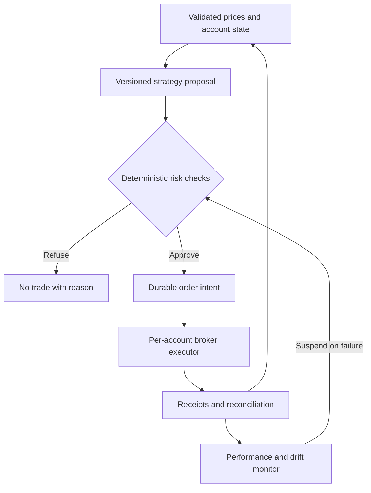

# Trezo robustness review and build roadmap

Date: September 8, 2026. Reviewed source: `4163078bdd11aafdfeb481070f2e2749e43d904a` on `main`, plus the bounded safeguards and offline income planner in this review branch.

Trezo has a substantial paper trading foundation: thirty registered agents, per-book routing, risk gates, broker reconciliation, a dashboard, and a growing offline test suite. The next milestone should be a trustworthy account-level performance record and an engine whose decisions can be replayed. The material reviewed does not establish a repeatable, profitable trading edge or a dependable 1% daily return.

This review preserves the Trezo name, the existing paper-only rollout, and the owner's selected risk settings. The proposed roadmap is separate from the small code repairs included with it. It does not authorize deployment, live execution, account funding, or changes to held design decisions.

## Evidence and limits

Inputs were both supplied engine-reference PDFs, `CLAUDE.md`, the context export and audit brief, the current measurement program, the go-live checklist, and targeted source/call-path inspection. Findings below distinguish confirmed code behavior, offline reproductions, and matters that still require deployed evidence.

GitHub access worked. A connected Alpaca market-data probe returned quotes and indicative option Greeks. The initial Supabase project listing omitted Trezo; the project link subsequently supplied by Mike enabled a successful direct connection and read-only schema, policy and aggregate-ledger inspection. See the [learning-loop build plan](TREZO_LEARNING_LOOP_BUILD_PLAN.md) for the follow-up findings and implemented restricted research pilot. Broker execution receipts, reconciled account returns and the running Windows engine's SHA remain unverified. No trading engine was started against credentials and no orders were submitted. Historical incidents in the reference documents must not be treated as independently established current balances.

The checks exercised Python behavior in an isolated environment without application secrets. They do not certify the dashboard build, production configuration, deployed RLS, execution quality, or the Windows server's running process.

## Confirmed findings, in implementation order

### 1. Paper mode allowed a configurable live destination — repaired in this branch

In `agents/app/brokers/alpaca.py`, `_base_url()` previously returned a bound account's arbitrary `base_url`, or the fallback configuration URL, when the live gate was closed. Offline reproduction returned `https://api.alpaca.markets` with that gate still false. The actual GET/POST/PATCH/DELETE transports consume this function.

A live URL combined with matching live credentials could therefore bypass the intended paper boundary. This is a configuration vulnerability; there is no evidence here that live orders occurred.

The new `agents/app/brokers/endpoints.py` accepts only the canonical HTTPS paper endpoint, with existing trailing-slash and `/v2` forms supported. It refuses other origins and paths before requests leave the adapter, without echoing potentially sensitive input. The synchronous asset lookup and account-route audit use the same validator. Validation happens per request so an invalid book does not disable a valid sibling. The existing live-executor availability gate remains closed.

Acceptance evidence: tests exercise the real four broker transport functions with a fake HTTP client, verify zero outbound calls for refused destinations, verify valid paper requests, and cover independent books and the two auxiliary readers.

### 2. Zero buying power was treated as an absent constraint — repaired in this branch

`agents/app/paper/sizing.py:plan_position()` previously applied buying power only when it was positive. With $10,000 equity, a $100 entry, $95 stop, $110 target, 1% risk, and **zero** supplied buying power, an offline reproduction approved 20 shares / $2,000 notional. Stock and crypto execution paths in `agents/app/agents/trade_execution.py` pass the tightest broker, pocket, and lane budget to this function, so zero can reach the faulty branch.

The planner now refuses supplied zero, negative, nonfinite, or malformed budgets. A positive budget still caps position size; `None` retains the existing explicit no-supplied-budget contract. Risk percentages and reward/risk policy are unchanged. Tests cover stocks, fractional crypto, exhausted and funded books, and the valid positive-budget behavior.

### 3. Account ownership can authorize global administration — next security change

`web/src/lib/auth-guards.ts:requireOwner()` uses `TREZO_OWNER_USER_IDS` when configured. Without that allowlist, owning an active `trading_accounts` row is sufficient. `web/src/app/api/agents/[name]/toggle/route.ts` uses this guard for a global engine operation.

That fallback does not distinguish a future customer's account ownership from platform administration. Whether the deployed environment has the explicit allowlist is unverified. This is a conditional authorization defect for a multi-user rollout, not evidence of a successful intrusion.

Introduce separate platform-admin and account-owner checks, enforce ownership of each requested resource, and run negative tests with two unrelated owners. Test both API authorization and actual database RLS. The shared-secret protection and server-side credential handling in `/api/internal/broker-token` exist in source; this does not establish that every deployed route and policy is correct. No auth behavior changes are included in this branch.

### 4. Reported profit is not yet a complete account-return measure

`agents/app/paper/performance.py` aggregates closed `paper_positions` and computes drawdown from realized trades. That view omits open losses and does not explicitly segment internal simulation, broker paper, and live provenance. The baseline query lacked explicit pagination. The follow-up local fix paginates per book, detects incomplete reads and labels its results as recorded closed-row metrics with unverified fees and no verified account return or promotion eligibility. `strategy_discovery.py` consumes this performance function and now emits those qualifications; historical accounting and current marked-equity reconciliation remain outstanding.

`agents/app/paper/daily_goal.py` also uses realized closes, with a 500-row query cap. `daily_goal_for()` applies a minimum $50 goal: it returns $50 for a $100 account. That is a 50% daily target for that example, incompatible with the proposed small-account product. The kill-switch's realized-P&L limits are not substitutes for account-equity drawdown limits. These are design changes to resolve explicitly; this branch does not alter the owner's chosen gates.

Build reconciled account valuations, paginate source events, preserve execution provenance, and expose open P&L beside realized P&L. Preserve historical rows and record corrections with broker evidence and an audit trail. An unavailable broker read must continue to mean unknown, never an empty account.

The settings model and database-row fallback in `agents/app/runtime/settings.py` use 5% risk per trade. The sizing function's 1% fallback is not evidence that every book runs at 1%. Inspect each deployed book's settings and aggregate exposure before choosing the future small-account policy; this branch preserves those settings.

### 5. The research lab does not faithfully replay the execution system

`agents/app/backtest/engine.py` uses simplified long-only, single-position trades, same-bar-close entries after scoring that bar, exact stop fills even across gaps, and no explicit fees or slippage. It does not replay the live risk budget and order lifecycle. Its compounded instrument returns should not be presented as observed account returns.

Threshold defaults also conflict with the 0–100 scorer: `run_backtest()` and `compare_strategies()` default to 700, while the main backtest endpoint explicitly passes 70. The separate simulation route defaults to 650 in `agents/app/main.py`, `agents/app/data/simulation_lab.py`, and the web API. Thus the main backtest route and simulation route have different behavior; it would be incorrect to say all backtests are broken. The summarized trade log retains only the last 50 trades, which also limits downstream replay.

Replace these mismatches with one validated score contract. Evaluate decisions on information available at the decision timestamp, execute on a later eligible quote/bar, model gaps and costs, and replay the same sizing and portfolio constraints. Compare candidates on untouched periods rather than selecting an in-sample winner from many variants. These changes are proposed, not included here.

### 6. Options need a complete market-data and lifecycle contract

`agents/app/brokers/alpaca_data.py` has a `LiveOption` record containing contract identity, strike, expiry, and premium. Its quote helper reduces data to a price and uses the indicative feed; it does not carry bid/ask timestamps or Greeks into selection. The picker favors strike and expiry proximity. `agents/app/options/pricing.py` uses a fixed rate and simplified pricing, and the dividend strategy contains placeholder forecasts.

There is also a concrete adapter mismatch: `agents/app/brokers/active.py:_alpaca_chain()` calls `get_option_contracts()` with one argument although the current helper requires six, catches the error, and returns an empty chain. It subsequently expects a dictionary from `get_option_quote()`, which actually returns a float. This endpoint needs contract tests and a coherent typed result before its chain can support decisions.

A September 8 connected-data probe returned 129 indicative KO put records; 105 included non-null Greeks and implied volatility. This establishes that data was available through that connection, not that the deployed engine has the same entitlement or that indicative quotes are executable. Alpaca distinguishes indicative options from OPRA data and individual Trading API access from Broker API plans. Confirm feed and redistribution rights for the intended product. [Alpaca market-data documentation](https://docs.alpaca.markets/us/docs/about-market-data-api)

### 7. Fees, calendars, and new instruments need explicit models

The crypto paths contain fixed cost assumptions that should not stand in for actual venue charges. Alpaca currently publishes a lowest-volume tier of 0.15% maker / 0.25% taker per side: roughly 0.50% for two taker legs before spread and slippage. Fees can be charged in the received asset. Persist actual fee events and value them consistently. [Alpaca crypto fees](https://docs.alpaca.markets/us/docs/crypto-fees)

A single September 8 quote probe showed approximately 3 basis points of ETH/USD spread and 58 basis points of LTC/USD spread. These are momentary observations, not expected trading costs or recommendations; they illustrate why a universal spread assumption is insufficient.

`position_monitor.py:_decide_time_stop()` uses a fixed 19:45 UTC calendar exit. That does not represent the same Eastern local time across daylight-saving changes or handle early closes. Use exchange calendars and local session definitions while preserving the intended exit policy.

The current Alpaca adapter is substantive; other broker entries include stubs. A broker listed in the dashboard does not establish implemented execution. No complete futures or direct-bond executor was identified. Bond ETFs can use equity infrastructure where eligible; direct bonds and futures require distinct accounting and contract specifications.

Forex also remains modeled. `forex_scanner.py` uses fiat-pair candles and emits signals, but it is dormant when broker-only mode disallows modeled forex. The risk manager applies the corresponding veto, and `trade_execution.py:_execute_for_user()` routes permitted forex signals to `_execute_internal()`; there is no forex broker branch. Enabling that scanner is not evidence of executable forex income. Forex research would need a suitable broker adapter and actual spread, financing, margin and fill models before any real-money evaluation.

## Corrections to the supplied references

The PDFs are useful context, but several statements no longer match the reviewed code or current vendor behavior.

| Reference concern | Current evidence | Implication |
|---|---|---|
| ORB and Extended Hours still use 0–1000 scores | Their current strategy scores and scanner normalization use 0–100; `test_tcs_scale.py` covers the contract | Preserve these repairs; investigate the separate lab defaults above |
| Scheduler startup arguments remain mismatched | Current startup calls `start_scheduler()` without those arguments | Verify the running server version before attributing a current outage to this old defect |
| One daily-dollar limit stops every book | Current risk manager and executor evaluate that dollar condition per book | Source is corrected; this session did not verify deployed firing behavior |
| Paper crypto fills are real exchange executions | Alpaca paper simulates fills and does not route crypto orders to a live exchange | Label all such results broker paper, separately from internal simulation and live |
| Vendor option Greeks are unavailable | The connected indicative probe returned Greeks and IV | Wire a validated data contract and confirm engine entitlements |

Alpaca also documents paper omissions including market impact, latency-related slippage, queue position, regulatory fees, and dividends. Consequently, paper results alone cannot validate execution economics or a dividend-income engine. [Alpaca paper-trading documentation](https://docs.alpaca.markets/us/docs/paper-trading)

## Annual capital growth and income planning

The confirmed initial research balances are **$1,000 and $5,000**. The latest working ambition is **$20,000–$40,000 of supplemental annual income over time**, with profits retained during accumulation and a withdrawal considered at year-end. Six-figure income remains a longer-term aspiration; the earlier $250,000 and $1 million examples are comparison scenarios, not operating assumptions. Keep 4%-monthly and fixed-dollar monthly requests as alternatives. Accessible entry and optional deposits remain core requirements. These are planning inputs, not observed balances or verified income rates, and the platform cannot promise a target balance, income or completion date.

Income goals are not trading-return estimates. The return is measured against invested capital, not against a person's salary. With no new deposits or costs, a $20,000/$40,000 first-year profit requires 2,000%/4,000% on $1,000 or 400%/800% on $5,000. Treat the supplemental-income goal as a longer-term research objective, not a first-year livelihood commitment. Do not use the emotional importance of the goal to relax risk or promotion criteria.

### Implemented offline starter planner

`agents/app/paper/income_planner.py` now provides a standard-library-only calculator and a real command-line entry point. It does not import runtime configuration, brokers, credentials or a ledger. The default report includes both starting balances and both supplemental-income goals, but makes no return forecast:

```bash
# Run from agents/. Default: required-return arithmetic, no projected gains.
python -m app.paper.income_planner

# Independent hypothetical outcomes, with an explicitly entered fixed cost.
python -m app.paper.income_planner --annual-returns-pct -20 0 5 10 20 --fixed-annual-cost 240

# Accumulation example: keep gains and distinguish an optional year-end deposit.
python -m app.paper.income_planner --income-goals 0 --annual-returns-pct 10 --year-end-deposit 1200
```

The supplied return is after variable trading costs and before the separately entered fixed annual cost and personal taxes. Fixed cost defaults explicitly to zero as an input assumption, not a claim that Trezo operates for free. Contributions are credited at year-end after the modeled return, so they earn no return in this simple comparison. Each row is an independent one-year scenario, not a simulated trading history.

The output reports trading results, costs, deposits, the income shortfall, an illustrative profit-only payout, remaining net equity and any unfunded cost liability. The payout assumes positive gains can be realized as settled cash, is capped by net gains and the requested amount, and includes no personal-tax or retained-profit reserve. It is not actual withdrawal eligibility. Missing/invalid inputs, nonfinite values and negative monetary requests are refused; a deposit never becomes profit. The calculator explicitly labels both strategy performance and actual withdrawal eligibility as unverified.

This is a working planning utility. The strategy replay, reconciled account review, dashboard integration and income transfers remain separate work. The twelve new tests exercise money/cost/deposit/loss handling and the real CLI through both required test runners.

### Annual dollar goals and deferred withdrawals

Store desired annual income separately from a target account balance. A $100,000 account is not the same as $100,000 of annual profit or a $100,000 eligible withdrawal. Interpret the new six-figure and larger examples as annual income scenarios; let a future user choose explicitly between income and account-value goals.

For the current supplemental-income scenarios, generating and withdrawing the profit while preserving nominal starting capital in one year requires the capital shown **if** the assumed annual net return is achieved, without external cash flows:

| Annual supplemental-income scenario | At 5% net annual return | At 10% net annual return | At 20% net annual return |
|---:|---:|---:|---:|
| $20,000 | $400,000 | $200,000 | $100,000 |
| $40,000 | $800,000 | $400,000 | $200,000 |

The earlier larger aspirations use the same arithmetic:

| Annual profit/income scenario | At 5% net annual return | At 10% net annual return | At 20% net annual return |
|---:|---:|---:|---:|
| $100,000 | $2,000,000 | $1,000,000 | $500,000 |
| $250,000 | $5,000,000 | $2,500,000 | $1,250,000 |
| $1,000,000 | $20,000,000 | $10,000,000 | $5,000,000 |

Formula: starting capital = desired one-year profit / achieved annual net return. These are conditional arithmetic scenarios after investment/platform costs and before personal taxes. The rates are not forecasts, recommended targets, or sustainable withdrawal rates. Withdrawing all gains leaves no retained gain for nominal capital growth and does not preserve purchasing power. Variable returns, losses, tax obligations, reserves and the desired horizon require separate assessment. [Schwab spending-rate considerations](https://www.schwab.com/learn/story/beyond-4-rule-how-much-can-you-spend-retirement)

With $5,000 and no contributions, $100,000 of first-year profit requires a 2,000% return and a $105,000 pre-withdrawal balance. Merely postponing withdrawals does not remove that return requirement. At an illustrative 20% annual net return, $5,000 earns $1,000 and becomes $6,000; withdrawing that $1,000 leaves $5,000 for the next year. Retaining it leaves more capital exposed to subsequent gains and losses. Contributions, elapsed time, returns and withdrawals must remain explicit separate inputs. [Investor.gov compounding calculator](https://www.investor.gov/financial-tools-calculators/calculators/compound-interest-calculator)

Proposed planner fields: `goal_kind` (annual income or account value), `target_amount`, `target_currency`, `target_tax_basis`, `withdrawal_schedule`, `minimum_accumulation_period`, `retained_capital_policy_id`, and `reinvestment_share`. A one-year accumulation scenario can be offered without making the first anniversary a guaranteed payday. Show the implied return, actual progress, eligible payout and unmet target separately. Record earlier 4%-monthly settings as a different policy rather than mixing percentages and dollar goals.

The annual review should reconcile broker cash, positions, fees and external flows; account for open losses and prior unrecovered losses; reserve required capital and obligations under the selected policy; and calculate a proposed payout bounded by the requested income, eligible net profits and available settled cash. A threshold crossing triggers review, not liquidation or a transfer. A missed target can leave the account in accumulation mode or produce a smaller/zero eligible payout. The actual policy requires owner selection; no transfer or risk-setting change is enabled here.

Long-term income requires evaluating repeated withdrawals through losing periods. One successful year or a briefly crossed balance threshold is insufficient evidence for a recurring paycheck. Agents may propose strategies and compare paths, but cannot change their risk budget, invent a return assumption or increase leverage to close the gap to an income goal.

### Earlier monthly withdrawal comparisons

For the previously discussed monthly alternative, keep requested income, eligible profit-funded income, unmet expenses, and any use of principal separate. Use 4% of month-opening marked equity as the comparison convention; assess actual eligibility again at payment time. A percentage of the account is not the same as a percentage of profits. This convention and eligibility rules are specifications, not deployed settings or an authorization for transfers.

| Portfolio snapshot | Requested monthly withdrawal at 4% |
|---:|---:|
| $500 | $20 |
| $1,000 | $40 |
| $5,000 | $200 |
| $25,000 | $1,000 |
| $50,000 | $2,000 |
| $100,000 | $4,000 |

These amounts are arithmetic requests before personal taxes, not expected income. For the supplied example expenses, $1,400 housing/insurance/utilities plus $500 food plus $175 every 45 days for health insurance average approximately $2,018.29 per month using a 365-day year. A 4% monthly request would first equal those listed expenses at about $50,457. That calculation does not establish sustainable withdrawals and excludes unlisted expenses, personal taxes and investment/platform costs.

Four percent monthly must not be labeled the retirement "4% rule." That guideline uses 4% of initial portfolio value for the first year's withdrawal, followed by inflation adjustments to the dollar amount; it is not a promised investment yield. [Schwab withdrawal-rule explanation](https://www.schwab.com/learn/story/4-retirement-rules-thumb-explained)

If an account earns zero and pays 4% of its remaining balance each month, $50,000 becomes approximately $30,635 after twelve payments; the next requested payment is about $1,225. This is a deterministic stress case, not a forecast. A withdrawal percentage alone does not make a household's fixed expenses affordable. Maintaining capital and growing toward the next milestone require net investment gains and/or new contributions, which must remain separately attributed.

Record monthly income coverage alongside calendar-year and trailing-year returns, contributions, withdrawals and drawdown. A shortfall must not force trades, alter strategy acceptance criteria or increase risk. Do not promise a time to $50,000 or $100,000 from an assumed steady return. Compare reinvestment and withdrawal paths and show sensitivity to contributions, costs and losing periods.

A 1% daily account return compounded for 252 trading days multiplies capital by approximately **12.27**, or **+1,127%**. Across 365 days it multiplies capital by approximately **37.78**. These are mathematical illustrations assuming the daily return is achieved and reinvested, not forecasts. Markets being open around the clock does not create an edge or eliminate losing periods.

The original 1% idea can remain a reference scenario. Do not force additional trades, raise risk after losses, or move to another market solely because a target is unmet. A valid no-trade decision must count as correct system behavior. AI cannot guarantee trading returns. [CFTC guidance on AI trading bots](https://www.cftc.gov/LearnAndProtect/AdvisoriesAndArticles/AITradingBots.html)

For comparison with the earlier fixed $500 target, the following is simple target arithmetic after trading/platform costs but before personal taxes, assuming no deposits and preservation of starting capital. It is not the current preferred withdrawal setting or an estimate of attainable returns:

| Starting balance | Monthly income target | Required monthly net return |
|---:|---:|---:|
| $5,000 | $500 | 10% |
| $7,000 | $500 | 7.14% |
| $10,000 | $500 | 5% |

For the $5,000 case, these independent one-month scenarios show what a fixed $500 withdrawal does. Net results include trading/platform costs; personal taxes and new deposits are excluded. The rates are illustrations, not forecasts or recommended return targets:

| Monthly net return | Trading profit or loss | Balance after withdrawing $500 |
|---:|---:|---:|
| -10% | -$500 | $4,000 |
| 0% | $0 | $4,500 |
| 5% | $250 | $4,750 |
| 10% | $500 | $5,000 |

The first row leaves $4,000, so the next $500 income payment would require a 12.5% monthly net return just to preserve that reduced balance. Depositing $500 later is new capital; it does not turn the preceding loss into earned income. If the requested $500 is spendable after personal taxes, more pretax profit may be required.

Model growth and withdrawal scenarios separately. Withdrawing the entire gain prevents that gain from compounding. Reinvesting profits can grow a balance, but elapsed time alone does not create profits or establish income readiness. Ten percent every month with all gains retained would imply approximately 213.8% compounded annual growth; that separate illustration is not the withdrawal scenario and is not a forecast.

### Proposed account modes

| Mode | Behavior | Transition or limit |
|---|---|---|
| Build capital | Retain profits, accept optional usable deposits, report annual growth and maximum drawdown | No minimum recurring contribution; no automatic switch to income after one year |
| Take income | At the selected review date, show the requested dollar income alongside the amount fundable from eligible profits and settled cash under the owner's policy; retain percentage-based requests as an alternative | Require reconciled results, recovery from prior losses under the chosen policy, retained operating capital and adequate reserves; an eligible payment can be below the request or zero |

These are product requirements, not changes to the existing engine settings and not an implementation of money transfers. Display requested income, profit-funded income, principal-funded withdrawals, and new deposits separately. Show the implied return on current capital and shortfalls honestly. The owner's maximum tolerable loss and whether experimental capital is separate from essential living-expense funds remain to be established before changing trading risk or funding behavior.

Research should evaluate small balances with no additional deposits as well as with optional contributions. Test eligible fractions, minimum orders, settlement, diversification limits and fees for each balance; never pretend a contract fits because an account is small. Show fixed platform/data/compute costs as a fraction of capital. For example, an illustrative $240 annual cost is 4.8% of $5,000 and 24% of $1,000, before trading costs or gains. The product must control that burden for users with limited capital.

Accessibility means offering learning/paper mode without a funding assumption, supporting funded accounts only where broker minimums and capabilities permit, and keeping contributions optional. It must not mean increasing leverage for users with smaller balances. Treat $25,000, $50,000 and $100,000 as user-selected progress milestones rather than entry requirements. Show contributions, net growth and withdrawals separately for every milestone; one person's account must never subsidize another person's apparent return.

Multiple strategies need portfolio-level evaluation. If half an account is assigned to each of two strategies and both earn 20%, the account earns 20% before shared costs, not 40%. Correlated positions and leverage must be included in stress losses. Aggressive trading is not a substitute for demonstrated net expectancy. FINRA warns that frequent margin trading can be unsuitable for people with limited financial resources and can lose more than the initial deposit. Funds needed for living expenses should be outside the trading experiment. [FINRA intraday-trading guidance](https://www.finra.org/investors/insights/frequent-intraday-trading)

Forex and crypto should be evaluated with the same income-coverage test. Forex leverage magnifies losses as well as gains, while crypto volatility can produce large unpredictable changes in capital. Neither market's availability establishes that the requested payment is dependable. [CFTC forex guidance](https://www.cftc.gov/LearnAndProtect/AdvisoriesAndArticles/CustomerAdvisory_MustKnowForex.html), [FINRA crypto risks](https://www.finra.org/investors/investing/investment-products/crypto-assets/risks)

The first research deliverable should replay small-account balances against distinct policies: retain gains; request annual dollar income after an accumulation period; request 4% of month-opening equity; request a fixed household-expense amount; and pay only eligible profits under a defined capital-preservation policy. Keep the earlier $5,000/$500 scenario as a stress case. Test early losses, a year-end loss after an earlier threshold crossing, a deposit that moves the balance past a threshold without creating profit, and a year with no eligible payout. No scenario requires top-ups. Report profit-funded income, principal use, unmet requests, remaining equity, deepest drawdown, costs and uncertainty. Use the reconciled ledger and realistic evaluator; do not generate a success probability from invented return assumptions. This test is specified, not yet implemented or passed.

Measure the following per account and strategy version:

- Total marked equity: cash plus positions, with liabilities and accrued/actual costs handled consistently. A realized win must not conceal a larger open loss.
- Cash-flow-adjusted return: value the account around deposits and withdrawals and chain the intervening subperiod returns for time-weighted performance. If exact valuations are unavailable, disclose the approximation. Report money-weighted return separately for the investor's deposit experience.
- Net expectancy: win probability times average win, minus loss probability times average loss, minus costs not already included. Avoid double-counting costs. For example, a 0.5 reward/risk ratio needs a 66.7% win rate merely to break even before costs.
- Drawdown, worst day, recovery time, turnover, exposure concentration, fill quality, and uncertainty around estimated expectancy. Win rate alone is insufficient.
- Separate internal simulation, broker paper, and any eventual live results. Show deposits, withdrawals, dividends, fees, and trading P&L as distinct events.

## An agentic architecture Trezo can audit

Mike clarified that autonomous strategy creation and adaptation to news, social information, regimes, and seasonal changes are core requirements. The companion [adaptive strategy specification](TREZO_ADAPTIVE_STRATEGY_SPEC.md) defines that capability, its connection to existing agents, and the distinction between automatic research and capital allocation. It is an implementation specification, not an enabled feature in this patch.

The thirty registered agents are largely scheduled or event-driven software components; their count does not measure predictive ability. Extend the existing bus with explicit evidence and authority boundaries:



Research agents may propose hypotheses, explain signals, and generate candidate code for review. They should not hold brokerage credentials, change their own risk limits, or promote their own strategy to execution. Treat retrieved news and model text as untrusted inputs; require structured proposals with timestamps, instrument identity, evidence, and version IDs.

Before expanding autonomy, verify durable intents with unique client order IDs, duplicate-event handling, per-account capital reservations, partial fills, cancel/replace races, restart recovery, and reconciliation after broker timeouts. A timeout after submission requires status lookup before any retry. A failed data read must halt the affected decision while healthy sibling accounts remain independent. Instrument-specific liquidation policies must not be invented by an LLM.

## Markets and small-account access

These are research tracks and product requirements, not proven profitable strategies or instructions to buy an instrument.

| Track | Initial research question | Required proof or capability |
|---|---|---|
| Liquid equities and ETFs | Does a restrained trend/regime filter improve existing signals after costs? | Corporate actions, survivorship-aware history, session calendars, fractional eligibility, realistic fills |
| Intraday equities | Does one existing ORB or pullback strategy retain positive net expectancy on unseen periods? | Next-event execution, spread/liquidity filters, capital reservation, settlement and account restrictions |
| Spot crypto | Does a liquid-pair trend or mean-reversion hypothesis survive fees and spread stress? | Actual fee tier, fresh quotes, 24/7 monitoring, outage recovery, asset precision and minimum order rules |
| Defined-risk options | Is there an edge beyond a high win rate or collected premium? | Validated chain, bid/ask, Greeks, contract multiplier, permissions, assignment/exercise/expiry, dividend exposure; spread execution if used |
| Bonds / short-duration exposure | Can eligible reserve assets reduce idle-cash drag without undermining liquidity? | Rate, credit and liquidity risk; direct bonds also need accrued interest, denomination, maturity and settlement models |
| Futures, later | Does a separately validated strategy justify contract and margin risk? | Tick value, multiplier, sessions, margin changes, expiry/roll, price limits and stress losses; micro contracts still carry leverage |

For broad access, make learning and paper mode available without a trading-capital assumption. Enable funded instruments only when the account can meet the venue's minimum order, settlement, permission, and risk requirements. Very small accounts may be limited to eligible fractions or cash holdings, or may rationally make no trade. Replace fixed dollar goals with an explicit account policy after the owner's decision. Deposits must add available capital only when usable at the broker and must never be reported as profit. Continued deposits should be optional, never a mechanism for rescuing a losing strategy.

The current `primary` / `acct2` / `acct3` registry is an owner's multi-book arrangement. A product for unrelated users requires arbitrary account enrollment, secure credential lifecycle, per-user permissions and reservations, recovery flows, and auditable isolation. Keep money at the selected custodian; application account records are not a substitute for regulated brokerage accounts.

Do not hardcode a universal $25,000 day-trading rule. FINRA's new intraday-margin requirements took effect June 4, 2026, with a transition permitted through October 20, 2027; firms may still apply the old framework during that transition. Obtain the actual broker/account restrictions and applicable jurisdiction. Most US securities settle T+1, which still matters for cash accounts. [FINRA Notice 26-10](https://www.finra.org/rules-guidance/notices/26-10), [FINRA settlement guidance](https://www.finra.org/investors/insights/understanding-settlement-cycles)

Serving other people's accounts with automated advice or discretion also requires a business-model and jurisdiction review before onboarding. The SEC describes obligations relevant to robo-advisers; which obligations apply to Trezo depends on its actual service. [SEC robo-adviser guidance](https://www.sec.gov/investment/im-guidance-2017-02.pdf)

## Delivery stages and acceptance gates

| Stage | Concrete deliverable | Gate to proceed |
|---|---|---|
| A. Close proven boundary defects | This paper-endpoint / buying-power patch; then role separation and options adapter repair | Both required Python gates pass; authorization has two-user negative tests; deployed version and relevant refusal logs verified after an authorized release |
| B. Establish financial truth | Broker-event import, reconciled positions/cash/fees, equity snapshots, provenance-aware dashboard | Unexplained discrepancies are visible and block affected decisions; deposits do not increase returns; open losses affect drawdown |
| C. Build reproducible research | One strategy, one venue, versioned dataset and event replay, realistic costs, held-out evaluation | Positive net expectancy with uncertainty reported; results survive cost and regime stress and a locked forward-paper period |
| D. Validate operational autonomy | Durable order lifecycle, replay/restart tests, outage drills, alerting and account isolation | Duplicate delivery, stale data, broker rejection, partial fills, restart and cross-account cases behave as specified |
| E. Consider bounded live use | Separate go-live review under the existing checklist and a defined loss budget | Owner decision, necessary broker/legal permissions, complete reconciliation and deployment evidence; no automatic promotion from paper |
| F. Expand users and markets | One additional account type or instrument family at a time | Instrument-specific accounting, permissions and risk tests; customer isolation and data licensing established |

Sample count alone is not a promotion gate: hundreds of correlated trades in one regime are not hundreds of independent observations. Specify the hypothesis, evaluation window, cost assumptions, drawdown budget, and failure criteria before examining the holdout result. Use shadow evaluation for proposed strategy changes; do not continually retune the live candidate to recent losses.

## Connections needed next

| Connection | Verified now | Next requirement |
|---|---|---|
| GitHub | Current repository can be read and review changes can be prepared | Review branch / draft PR; production deployment remains a separate step |
| Alpaca data | Quote and indicative option-chain reads work through the connected service | Verify the engine's feed entitlement and account permissions; obtain authenticated, read-only account/order/activity evidence through a suitable account connection or exports |
| Supabase | The connected project list does not expose Trezo | Connect the account/organization with the Trezo project, then inspect migrations, RLS, ledger and performance data read-only |
| Server operations | Not accessed in this review | Running commit, service health, recent per-book gate/reconciliation logs, and scheduled-job evidence through the existing operations workflow |
| Additional broker | No new broker integration established | Choose only after instrument scope is approved; IBKR is a candidate for stocks, options, futures and bonds, but requires an implemented adapter and appropriate market-data access |

IBKR documents APIs covering those instrument families and separate market-data subscription requirements. A ChatGPT broker plugin is a research/account interface; installing one does not wire Trezo's unattended execution service. [IBKR API overview](https://www.interactivebrokers.com/en/trading/ib-api.php), [IBKR API market data](https://www.interactivebrokers.com/docs/general/market-data-subscriptions/introduction)

No broad plugin purchase is necessary for the next milestone. The immediate missing connection is the correct Trezo Supabase project, followed by broker evidence and deployed logs. Enter credentials only through the appropriate secure connection or server-secret workflow, not chat or repository files. Keep account exports and raw financial records out of this public repository.

## Validation of this branch

Run from `agents/` in the isolated Python environment:

```text
python -m tests.run_all   -> 64 suites passed; 0 activity-log lines written
python -m pytest -q       -> 1003 tests passed
```

Before the changes, the same environment passed 61 suites and 976 tests. Fifteen added tests cover the two broker/sizing repairs and twelve cover the offline planner. The deploy-suite floor is now 64. The sequential deployment runner exposed an existing fake `_patch` function left active by `test_broker_stop.py`; that test now restores the original function in `finally`. One existing Supabase dependency deprecation warning remains. A separate real `python -m app.paper.income_planner` invocation also produced the explicitly supplied comparison cases successfully.

These results establish the local behavior of this bounded patch. They do not establish deployed remediation, successful real-money operation, or a profitable strategy. The next useful evidence is reconciled Trezo account data, not a higher promised return.
