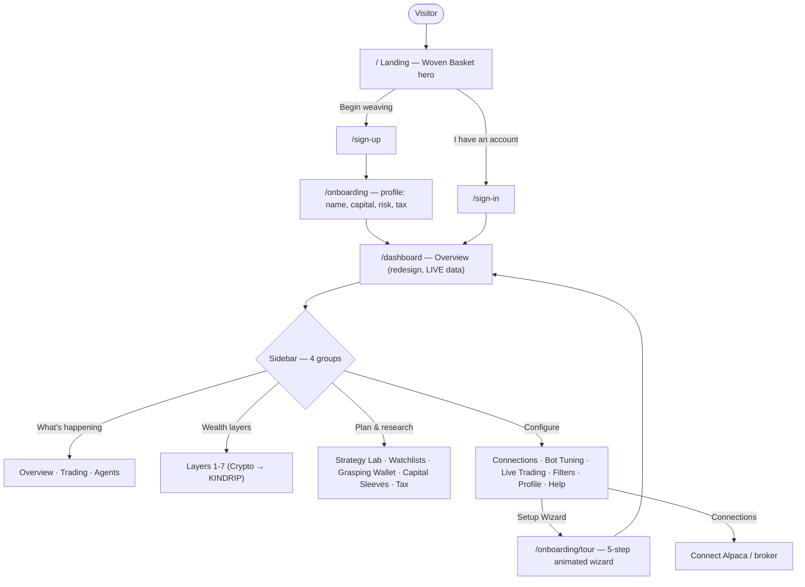
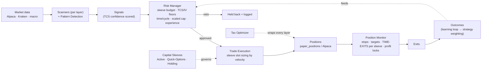

# Trezo — Site Map & App Flow
*Design handoff for the Figma bot. Generated 2026-06-18.*

This document describes **every screen in the Trezo app, how they're grouped, and how a
user (and the trading engine) flows through them** — so the design tool can lay out / restyle
the product with full context. Aesthetic = **Neo Obsidian**.

---

## 1. Design system (Neo Obsidian)

| Token | Value | Use |
|---|---|---|
| Background | `#0b0b11` (obsidian) | app canvas |
| Surface / card | `#12121b` | cards, panels |
| Foreground | `#e6e3f2` | primary text |
| Muted foreground | `~#6e6b88` | secondary text |
| Border | `#282838` | hairlines |
| **Gold (accent / "treasure")** | **`#c4964a`** | brand accent, active states, the inner vault |
| Emerald / Amber / Sky / Rose | status colors | up / caution / info / down |

**Fonts:** DM Sans (UI), **Playfair Display** (serif headers — old-world warmth), JetBrains Mono (numbers).
**Core metaphor — the Woven Basket:** seven concentric protection rings. Outer rings (1) take the
market's volatility; the inner vault (7, KINDRIP) is the treasure the rest protects. The **Tax
Optimizer** is a dashed thread that wraps every ring (not a numbered layer).

---

## 2. Site map (every screen, grouped)

### Public / marketing
| Route | Screen | Notes |
|---|---|---|
| `/` | Landing | Woven Basket hero, 7-layer explainer, CTAs |
| `/contact` | Contact | |
| `/privacy` | Privacy | |
| `/terms` | Terms | |

### Auth (shared `(auth)` layout)
| Route | Screen |
|---|---|
| `/sign-up` | Create account |
| `/sign-in` | Log in |
| `/forgot-password` | Request reset |
| `/reset-password` | Set new password |

### Onboarding
| Route | Screen | Notes |
|---|---|---|
| `/onboarding` | Profile setup | 4 steps: Identity, Capital, Discipline, Tax → saves profile |
| `/onboarding/tour` | **Setup Wizard (NEW, animated)** | 5 steps: Welcome, Broker, Mode, Layers, Risk cap |

### App — sidebar group **WHAT'S HAPPENING** (monitor)
| Route | Screen | Notes |
|---|---|---|
| `/dashboard` | **Overview** | Redesign + live data (landing after login) |
| `/dashboard/home` | Overview (classic) | Original landing — crypto/stock widgets + activity feed |
| `/dashboard/paper` | **Trading** | Workhorse: positions, close, manual trade, diagnostics |
| `/dashboard/trading-preview` | Trading · New | Redesign + live data |
| `/dashboard/agents` | **Agents** | Workhorse: toggle/run the 21 agents |
| `/dashboard/agents-preview` | Agents · New | Redesign + live data |

### App — sidebar group **WEALTH LAYERS** (outer ring → inner vault)
| Route | Layer | Screen |
|---|---|---|
| `/dashboard/crypto` | 1 | Crypto Bot |
| `/dashboard/stms` | 2 | Stock Bot (STMS) |
| `/dashboard/options` | 3 | Options Engine |
| `/dashboard/extended` | 4 | Stock Weekly (Extended) |
| `/dashboard/wheel` | 5 | Wheel (Options on dividend stocks) |
| `/dashboard/yieldmax` | 6 | Dividends |
| `/dashboard/kindrip` | 7 | KINDRIP (children's vault) |

### App — sidebar group **PLAN & RESEARCH** (plan)
| Route | Screen |
|---|---|
| `/dashboard/strategy-lab` | Strategy Lab (backtest) |
| `/dashboard/watchlists` (+ `/[id]`) | Watchlists |
| `/dashboard/budget` | Grasping Wallet (budget + projections) |
| `/dashboard/sleeves` | **Capital Sleeves** (NEW) — budget by horizon |
| `/dashboard/tax` | Tax Optimizer |

### App — sidebar group **CONFIGURE** (configure)
| Route | Screen |
|---|---|
| `/dashboard/settings/bot` | Bot Tuning (risk, confidence, strategies) |
| `/dashboard/strategy` | Strategy Engine |
| `/dashboard/settings/filters` | Ethical Filters |
| `/dashboard/settings/connections` | Connections (connect Alpaca/broker) |
| `/dashboard/settings/live` | Live Trading (paper↔live gate) |
| `/dashboard/settings/profile` | Profile |
| `/onboarding/tour` | Setup Wizard |
| `/dashboard/help` | Help & FAQ |

### Utility / not in main nav
| Route | Screen | Notes |
|---|---|---|
| `/dashboard/markets` | Markets | macro / cross-asset |
| `/dashboard/stocks` | Stocks | watchlist quotes |
| `/dashboard/patterns` | Patterns | pattern glossary |
| `/dashboard/backtest` · `/simulation` | Backtest / Sim | analytics |
| `/dashboard/live` → `/paper` · `/performance` → `/dashboard` · `/projections` → `/budget` | Redirects | legacy URLs |

---

## 3. User / screen flow

---

## 4. Trading logic flow (the engine behind the screens)

**Capital Sleeves** (the new money model) split equity by time-horizon and bound execution:
- **Active** (intraday→next-day): STMS/ORB/pattern, crypto scalp, extended. Fast bite (~30%), 5-day max hold.
- **Quick Options** (2–3 day): directional calls/spreads. Take profit at +30% and recycle. 4-day max hold.
- **Holding** (days→indefinite): Wheel, Dividends, crypto HODL, KINDRIP cores. Held by design.

---

## 5. Notes for the designer
- **Overview / Trading / Agents** each have a **redesigned (Neo Obsidian) version** AND a feature-rich **classic** version. The redesign is the default; classic keeps the action tools.
- Every dashboard screen sits inside the **sidebar shell** (4 gold small-caps groups, numbered layer pips 1–7 with a connecting thread, gold active border).
- Numbers use the mono font + tabular alignment; headers use Playfair serif; everything else DM Sans.
- The **7 layers are ordered outer→inner** (1 = most volatile, 7 = most protected). Keep that ordering everywhere.
- Status semantics: emerald = active/profit, amber = idle/caution, sky = info/exit, rose = live/loss, gold = the brand + the treasure core.

- **Depth + motion (live):** the app uses a depth system — floating cards, raised panels,
  ambient page backdrops, and a parallax tilt on landmark cards (the Overview hero). The
  landing hero is a 3D atom (tilted shells + electrons + a pulsing nucleus). Keep every
  surface dimensional, never flat.
